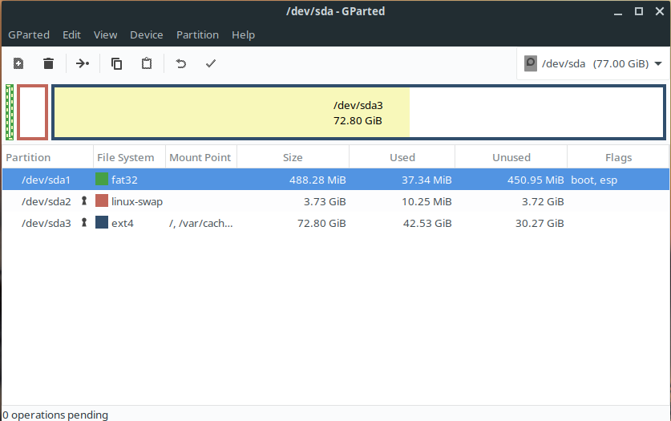
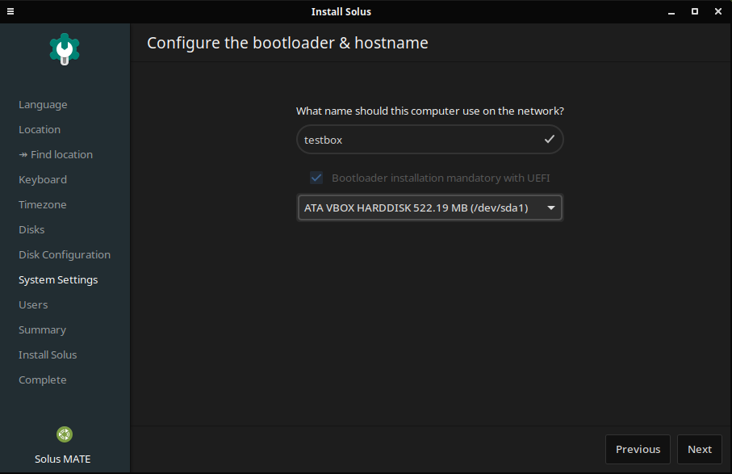
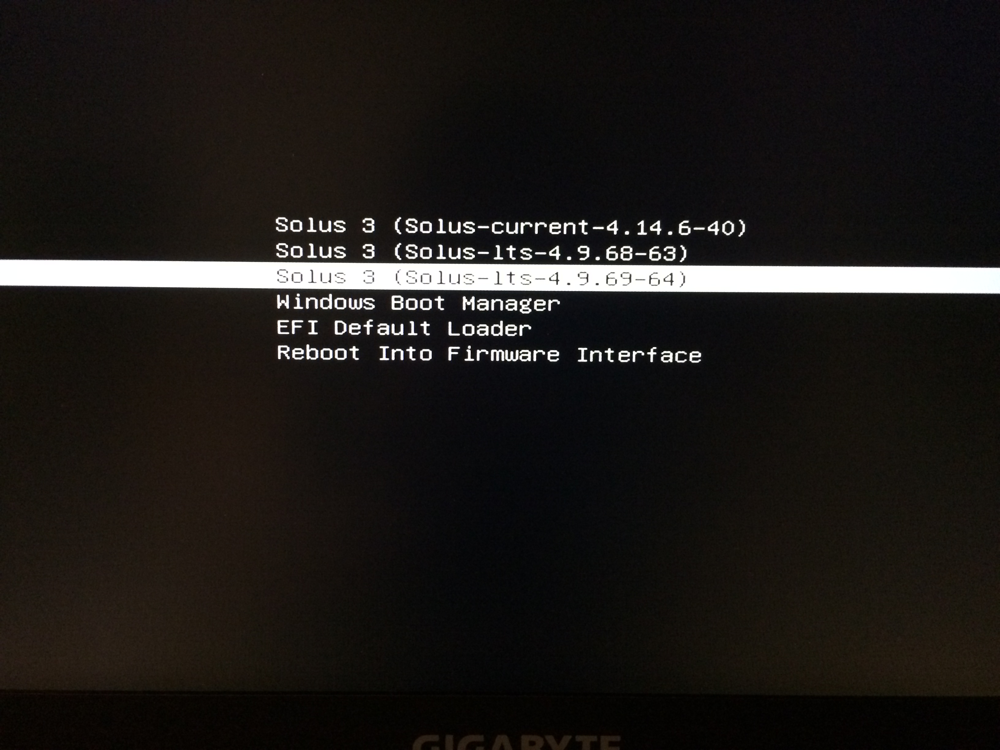

# About this guide

The aim of this guide is to help people who may face problem installing Solus on an EFI-capable computer but also the "_advanced_" users who have already installed flawlessly of other distributions and don't even take a minute to check the documentation because they are too smart and it has to be the distribution that is broken.
It's not meant to be exhaustive but rather to cover the most common situations. Of course it can be completed and contributions are welcome!

# Writing the Solus ISO

Before starting, let me drop a line about a **common problem** (and the importance to read documentation) : Solus uses hybrid formats for its ISOs, not every tool can handle such formats properly, so it is important to [check the supported methods](https://getsol.us/articles/installation/preparing-to-install/en/#getting-the-right-tool) to get a working ISO.

# Before you start

Modern computers can boot either in **UEFI** (a.k.a. **EFI**) or in **Legacy (BIOS)** mode. Only the first method will be covered by this guide.

Unless there is already an operating system installed in BIOS mode on the machine, I would advise you to always opt for UEFI. 
When booting the computer, press the manufacturer's key to get into your computer's firmware (common keys used: Esc, Del, F1, F2, F10, F11, or F12) you can try them all until you fing the good one, or you can look for your computer/mother's board manual (**tip**: Type the computer model and the word "manual" in your favorite web search engine to find it).

The firmware UI differs from vendor to vendor, so don't worry if it looks different on your computer than on this illustration.

**Important**: Before booting the ISO for the first time, you may want to get into the computer's firmware to
- Disable secure boot
- Set the SATA configuration to AHCI if you have a SSD drive

# Boot the Solus ISO

You can now boot the Solus ISO of your choice. If you see a `grub` screen, it means it's booting in Legacy/BIOS mode which is not what you want. Please reboot and make sure to select the UEFI entry in the menu.

**Note**: You can press `e` to append kernel parameters when the ISO starts booting. You normally don't need this unless you have some specific hardware (but this goes far beyond the objective of this guide).

# Automatic (easy) Installation

If you want to install Solus alongside another already installed operating system, you should have a look at the [EFI system partitions (a.k.a. ESP)](#efi-system-partitions-aka-esp) paragraph of the Advanced installation section.

Okay so now you're on the desktop of your choice you can run **Install OS**. If you want to perform an automatic installation, you can click it now and follow the instructions, remove the disk from the drive at the end of the installation and reboot.

# Advanced (manual) Installation

## Advanced partitioning 

**Warning**: These operations are potentially **dangerous** and may result in **data loss**. Be very cautious and **take backups** of your important data before going further. If there are multiple disks on your machine make sure to select the good one (on the right in the gparted toolbar).

If instead you want to perform a more advanced setup, like partitioning your disks your own way, first run **gparted** from the live ISO (unlike many installers, Solus doesn't handle manual partitioning during installation so you have to prepare it upfront).

## The (gpt) partition table

If not yet done, you'll have to create a new partition table, forget about `msdos` this is for legacy boot, you have to create a `gpt` partition table.

## EFI system partitions (a.k.a. ESP)

Although it is possible to create multiple ESPs, I highly [not recommend](https://news.ycombinator.com/item?id=16261695) to do so. Also make sure the partition is large enough as this is a common source of problems. If another OS is already installed on the disk, you should consider rezising the partition before going further (typically Windows creates a 100Mb ESP partition).

The ESP partition is usually the first partition on the disk. It must be `fat32` formatted and have the `boot` and `esp` flags. Solus [recommands 512Mb](https://getsol.us/articles/installation/disks/en/) for this partition. This is very important if you install multiple operating systems or if you install multiple kernels (typically the _current_ and the _lts_ kernels). If you have no clue what _current_ and _lts_ kernels are, you shouldn't worry about this.

## Other partition(s)

You can then create other partitions for Solus 
- mandatory a `/` (root) partition - `ext4` formatted
- optionally a `/home` partition - `ext4` formatted
- optionally a `swap` partition (if you don't create a swap partition, you may want to create a swap file instead).

## OS Installation (advanced mode)

Apart from assigning the mount points to the partitions you have prepared, an important thing that may annoy you if you have multiple ESP partitions is that Solus installer (like most other linux installers available today), will automatically install its bootloader on the first ESP partition.

# Wait, how do I multiboot without Grub ?

Use the boot manager menu from your computer's firmware as show on the [first illustration](#efi-bootmanager). It isn't as sexy and as customizable as grub and yeah you have to press a key to make it appear on the screen, it's not cool. But whether you like it or not, this is actually the **right way to proceed**, it's up to the computer's firmware to manage this, not to the operating system.

Alternately, you can spam the space bar when booting Solus to display the systemd boot menu. Although it recognize Windows when it's installed on the same ESP partition, the goal of this menu is to allow you to rollback to the previous version of the kernel in case you should face a problem after an upgrade. You can find more info about this on the [help center](https://getsol.us/articles/troubleshooting/boot-management/en/)

# A last word

You may have noticed that `/boot` is not mounted when Solus is started. This is because `clr-boot-manager` only mounts this filesystem the time it's required and unmounts it immediately afterwards. This adds an extra level of safety. The drawback is that the few software that may have to legitimately interract with it, should be integrated with `clr-boot-manager` and this piece is not yet in place. See [fwupd](https://dev.getsol.us/T2532) or [rEFInd](https://dev.getsol.us/T4089).
